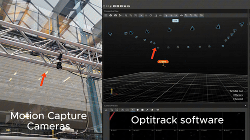

# SpotDigitalTwin

## Installation:


### Installing venv
```
python3 -m pip install venv
```
### Initializing the virtual environment
```
python3 -m venv venv
```
### Activating the virtual environment
```
source /venv/bin/activate
```
### Setup the simulation
```
pip install genesis-world  # Requires Python>=3.10,<3.13;
```

### Examples
```
python3 examples/locomotion/spot_eval.py
```
